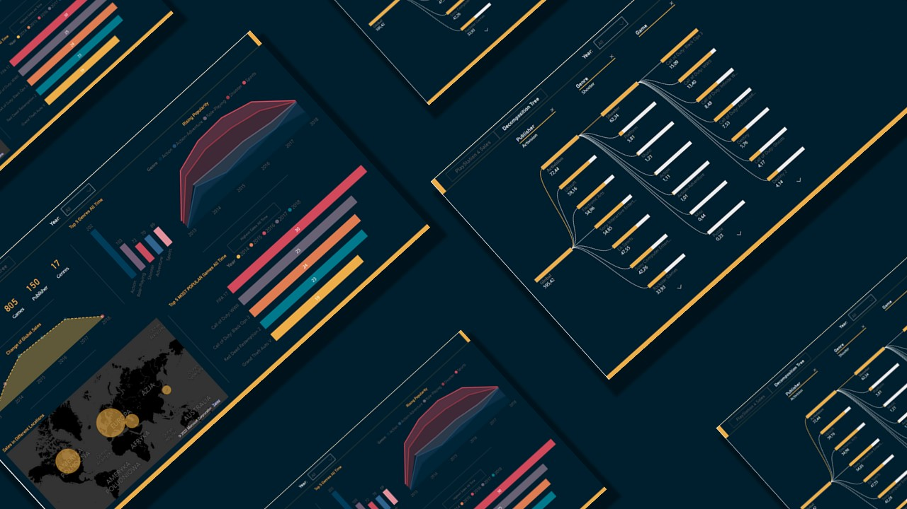
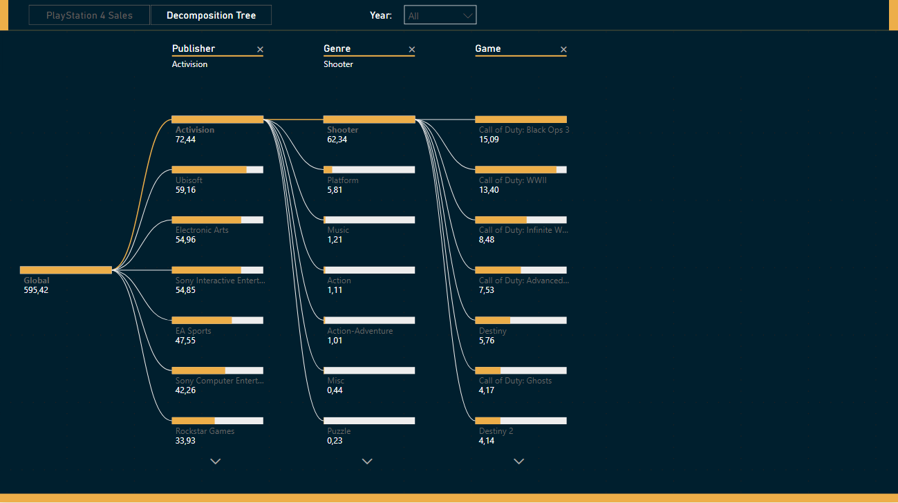
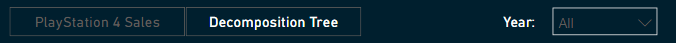
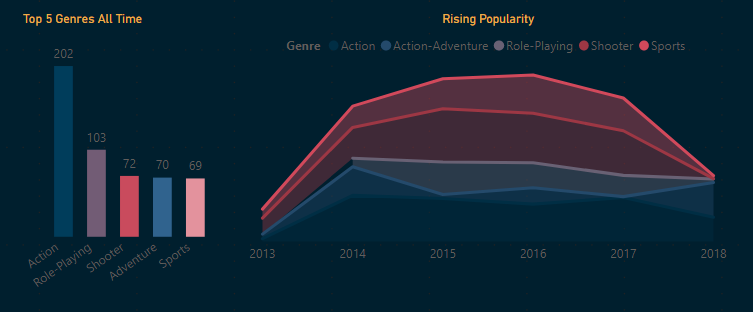
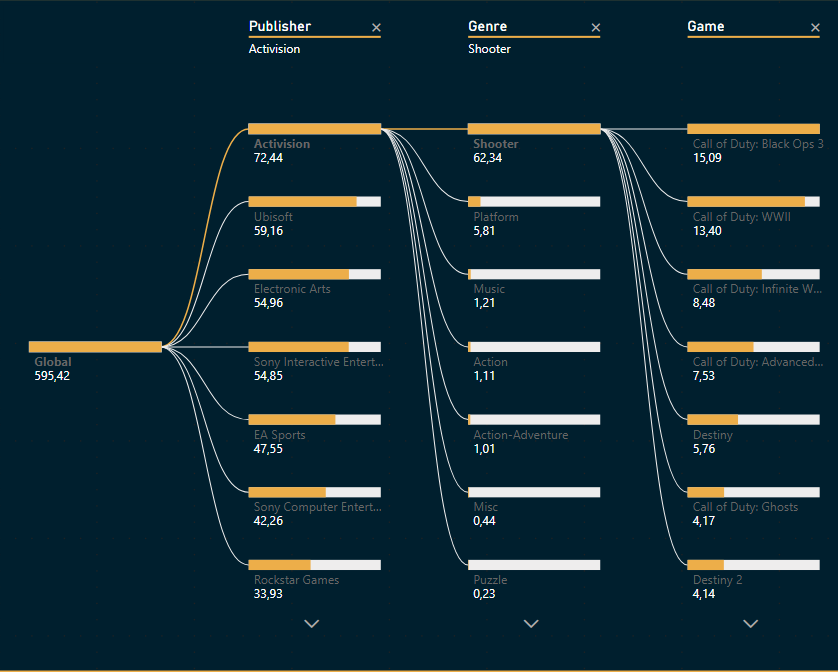

#### -- Project Status: [Completed]

# PS4 Games Sales Dashboard

<!-- PROJECT SHIELDS -->
<!--
*** I'm using markdown "reference style" links for readability.
*** Reference links are enclosed in brackets [ ] instead of parentheses ( ).
*** See the bottom of this document for the declaration of the reference variables
*** for contributors-url, forks-url, etc. This is an optional, concise syntax you may use.
*** https://www.markdownguide.org/basic-syntax/#reference-style-links
-->

<!-- TABLE OF CONTENTS

  
Table of Contents

  <ol>
    <li>
      <a href="#about-the-project">About The Project</a>
      <ul>
        <li><a href="#built-with">Built With</a></li>
      </ul>
    </li>
    <li>
      <a href="#getting-started">Getting Started</a>
      <ul>
        <li><a href="#prerequisites">Prerequisites</a></li>
        <li><a href="#installation">Installation</a></li>
      </ul>
    </li>
    <li><a href="#usage">Usage</a></li>
    <li><a href="#roadmap">Roadmap</a></li>
    <li><a href="#contributing">Contributing</a></li>
    <li><a href="#license">License</a></li>
    <li><a href="#contact">Contact</a></li>
    <li><a href="#acknowledgments">Acknowledgments</a></li>
  </ol>

-->

## About the project

### Purpose

The purpose of this dashboard is to:

- present a change in games sales for the Playstation 4 platform,
- explore the most popular genres and games of all time and per certain year,
- show connections between publishers, genres and games.

### Dataset

Dataset was taken from keggle. It required a bit of cleaning (steps can be found in the PowerBi file). I have created a table of top games per year, custom columns and measurements with DAX and M language.

### Conclusion

1. From 2013 to 2015 we can obsereve an increase in sales. In 2015 sales start to drop to hit a bottom in 2018. A reason for that would be the fact that PS4 had its premier in 2013 and 2018 was the year when PS5 was announced.
2. The most popular genre on average was the action genre. Sports and shooters had the biggest gain of popularity over a period of time.
3. The all-time bestseller was GTA 5 but the biggest per year sales had Fifa 17 in 2016.
4. The biggest market for PS4 was Europe.

### Potential improvements

A nice addition would be a comparison between different platforms and a rating of the games, to have a more comprehensive view of the market.

### Methods Used

- Statistics
- Data Visualization
- DAX
- Data Cleaning

### Built With

- [PowerBi](https://powerbi.microsoft.com/)
- [DAX](https://docs.microsoft.com/en-us/dax/)

An overview of the used visuals you can find below.

(<a href="#top">back to top</a>)

## Usage of the dashboard

Dashboard consists of two pages.

|      PS4 Sales Visuals      |     Decomposition Tree     |
| :-------------------------: | :------------------------: |
|  |  |

Menu on the top takes to different pages. Slicer Year allows to put Year filter on visuals.

### PS4 Sales Visuals

Global sales and its change over a period of time.

Global sales per location.

Top 5 most popular genres of all time.

It is possible to swap between two visuals with the button above them.

The most popular game of the year.

The most popular games of all time.

### Decomposition tree

Tree visual showing connections between global sales, publishers, genres and games.

(<a href="#top">back to top</a>)

## Contact

Joanna Wlodarczyk - [@linkedin](https://www.linkedin.com/in/joannawlodarczyk/)

Project Link: [https://github.com/JMWlodarczyk/PS4-Games-Sales-Dashboard](https://github.com/JMWlodarczyk/PS4-Games-Sales-Dashboard)

(<a href="#top">back to top</a>)

