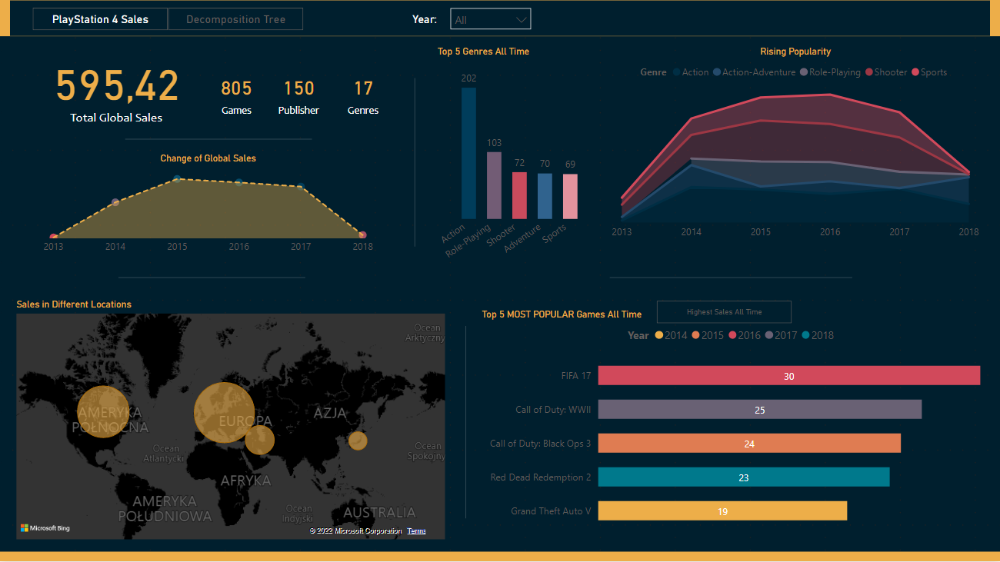

# PS4-Games-Sales-Dashboard

#### -- Project Status: [Completed]

<!-- PROJECT SHIELDS -->
<!--
*** I'm using markdown "reference style" links for readability.
*** Reference links are enclosed in brackets [ ] instead of parentheses ( ).
*** See the bottom of this document for the declaration of the reference variables
*** for contributors-url, forks-url, etc. This is an optional, concise syntax you may use.
*** https://www.markdownguide.org/basic-syntax/#reference-style-links
-->

<!-- TABLE OF CONTENTS

  
Table of Contents

  <ol>
    <li>
      <a href="#about-the-project">About The Project</a>
      <ul>
        <li><a href="#built-with">Built With</a></li>
      </ul>
    </li>
    <li>
      <a href="#getting-started">Getting Started</a>
      <ul>
        <li><a href="#prerequisites">Prerequisites</a></li>
        <li><a href="#installation">Installation</a></li>
      </ul>
    </li>
    <li><a href="#usage">Usage</a></li>
    <li><a href="#roadmap">Roadmap</a></li>
    <li><a href="#contributing">Contributing</a></li>
    <li><a href="#license">License</a></li>
    <li><a href="#contact">Contact</a></li>
    <li><a href="#acknowledgments">Acknowledgments</a></li>
  </ol>

-->

## About the project

### Purpose

The purpose of this dashboard is to present a game sales change for the Playstation 4 platform and explore what are the most popular genres and games of all time and per certain year. Additionally, I added the decomposition tree visual, so the user could see the exact connections between publishers, genres and games.

### Value

A potential value to this type of dashboard is an estimation of what type genres and games bring the biggest value, how trends during the years do change and what the customers are looking after.

### Improvements

A nice addition would be a comparison between different platforms and a rating of the games, to have a more comprehensive view of the market.

A detailed explanation of the used visuals you can find below.

### Methods Used

- Statistics
- Data Visualization
- DAX

(<a href="#top">back to top</a>)

### Built With

- [PowerBi](https://powerbi.microsoft.com/)
- [DAX](https://docs.microsoft.com/en-us/dax/)

(<a href="#top">back to top</a>)

## Usage of dashboard

Use this space to show useful examples of how a project can be used. Additional screenshots, code examples and demos work well in this space. You may also link to more resources.

(<a href="#top">back to top</a>)

## Contact

Your Name - [@twitter_handle](https://twitter.com/twitter_handle) - email@email_client.com

Project Link: [https://github.com/github_username/repo_name](https://github.com/github_username/repo_name)

(<a href="#top">back to top</a>)

